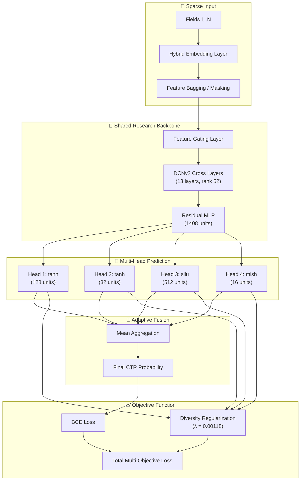

# 🔬 CTR Architecture Research Laboratory

<div align="center">

### 🏆 Advancing State-of-the-Art Click-Through Rate Prediction via Literature-Hybrid Architectures

[](https://pytorch.org/)
[](https://www.python.org/)
[](https://optuna.org/)
[](https://pola.rs/)

<br/>

| 🎯 **Best Private LogLoss** | 📊 **Best Public LogLoss** | ⚡ **Training Time** |
|:---------------------------:|:--------------------------:|:-------------------:|
| **0.38484** | **0.38671** | ~45 min (single epoch) |

</div>

---

## 🏛 Research Vision

This project serves as a laboratory for exploring and synthesizing state-of-the-art architectures in **Click-Through Rate (CTR)** prediction. Rather than implementing a single traditional model, we focus on **Hybrid Architecture Synthesis**—combining orthogonal strengths from various seminal research papers into unified, high-performance encoders.

Our primary goal is to investigate how **explicit cross-networks**, **attention-based encoders**, and **field-level importance gating** can be fused to capture complex feature interactions in high-cardinality sparse datasets like Avazu.

---

## 🏆 Best Results & Optimal Configuration

Our best submission achieved a **Private LogLoss of 0.38484** and **Public LogLoss of 0.38671** on the Avazu CTR Prediction competition. Below are the optimal hyperparameters discovered through extensive Optuna-based Bayesian optimization.

> 💡 **Tip**: You can modify these parameters in [`config.py`](config.py) to experiment with different configurations.

<details>
<summary><b>📋 Click to expand full optimal configuration</b></summary>

### 🔧 Model Architecture

| Component | Parameter | Value |
|-----------|-----------|-------|
| **Backbone** | Type | `gated_dcn` |
| **Diversity** | Weight | `0.001177` |
| **Feature Bagging** | Ratio | `0.827` |
| **Aggregation** | Method | `mean` |

### 🌐 DCN (Deep Cross Network)

| Parameter | Value |
|-----------|-------|
| Enabled | ✅ `True` |
| Layers | `13` |
| Low Rank | `52` |
| LayerNorm | ✅ `True` |

### 🧠 MLP Backbone

| Parameter | Value |
|-----------|-------|
| Hidden Dims | `[1408]` |
| Activation | `relu` |
| Dropout | `0.101` |
| Skip Connections | ✅ `True` |
| LayerNorm | ✅ `True` |

### 🎯 Feature Gating

| Parameter | Value |
|-----------|-------|
| Enabled | ✅ `True` |
| Activation | `gelu` |
| Low Rank | `None` |

### 🔀 Diverse Prediction Heads

| Head | Hidden Dims | Activation | Dropout | LayerNorm |
|------|-------------|------------|---------|-----------|
| 1 | `[128]` | `tanh` | `0.455` | ❌ |
| 2 | `[32]` | `tanh` | `0.383` | ❌ |
| 3 | `[512]` | `silu` | `0.413` | ✅ |
| 4 | `[16]` | `mish` | `0.068` | ✅ |

### ⚡ Optimizer Configuration

**Dense Parameters (AdamW)**
| Parameter | Value |
|-----------|-------|
| Learning Rate | `2.234e-4` |
| Weight Decay | `3.203e-5` |
| Warmup Ratio | `0.402` |
| Decay Type | `none` |

**Embedding Parameters (Adagrad)**
| Parameter | Value |
|-----------|-------|
| Learning Rate | `0.589` |
| Weight Decay | `0.0` |
| Warmup Ratio | `0.346` |
| Decay Type | `linear` |
| Min LR | `2.04e-7` |

### 📐 Training Settings

| Parameter | Value |
|-----------|-------|
| Batch Size | `4096` |
| Epochs | `1` |
| Gradient Clipping | `4.968` |
| AMP | ✅ `float16` |
| Compile | ✅ `torch.compile` |

</details>

---

## 📚 Literature-Informed Architectural Pillars

The laboratory implements and synthesizes ideas from several key research directions:

<table>
<tr>
<td width="50%">

### 1. Deep & Cross Network Evolution (DCNv2/v3)
*   **Source**: *DCN V2: Improved Deep & Cross Network* (Wang et al., 2021)
*   **Mechanism**: Uses learnable weight matrices to model explicit, bounded-degree polynomial feature interactions.
*   **Hybrid Implementation**: Supports low-rank decomposition for parameter efficiency and gated units for non-linear interaction selection.

</td>
<td width="50%">

### 2. Squeeze-Excitation & Bilinear Interaction (FiBiNET/++)
*   **Source**: *FiBiNET: Combining Feature Importance and Bilinear feature Interaction* (Huang et al., 2019)
*   **Mechanism**: **SENet** layer dynamically learns field-level importance weights, followed by a **Bilinear Interaction** layer.
*   **Hybrid Implementation**: Incorporates multi-mode squeezing (Mean, Max, Min, Std) and grouped squeeze operations.

</td>
</tr>
<tr>
<td width="50%">

### 3. See-Through Transformer Encoding (STEC)
*   **Source**: *STEC-Transformer: See-Through Transformer-based Encoder for CTR*
*   **Mechanism**: A transformer-based encoder that extracts multi-head group bilinear interactions directly from attention mechanisms.
*   **Hybrid Implementation**: Features "See-Through" paths that preserve signal flow from all layers to the prediction head.

</td>
<td width="50%">

### 4. Multi-Head Diversity Enrichment
*   **Source**: *Research into Deep Ensembles & Diversity Regularization*
*   **Mechanism**: Utilizes a **Shared Backbone** with **Diverse Prediction Heads**, regularized by a **Diversity Loss** term.
*   **Implementation**: Features **Feature Bagging** (random field masking per head) and gated logit aggregation.

</td>
</tr>
</table>

---

## 🏗 The Hybrid: MultiHeadDiversityModel

The flagship architecture of this lab is the `MultiHeadDiversityModel`. It represents our current best attempt at architectural synthesis:



---

## 🚀 Experimental Framework

### Automated Hyperparameter Optimization (Optuna)

We use **Optuna** to navigate the vast search space (~34 parameters) of our hybrid architectures. Our advanced tuning script supports:

| Feature | Description |
|---------|-------------|
| 🌳 **TPE Sampler** | Tree-structured Parzen Estimator for Bayesian search |
| ✂️ **MedianPruner** | Aggressive early stopping of unpromising trials |
| 💾 **SQLite Persistence** | Resume large-scale studies across sessions |
| 📊 **Real-time Dashboard** | Optuna Dashboard for visualization |

```bash
# Launch a 100-trial optimization study
python misc/tune_hyperparams.py --n-trials 100 --timeout 28800
```

### Key Search Dimensions

- 🔢 **Interaction Depth**: Number of DCN layers vs. Transformer layers
- 🎛️ **Diversity Calibration**: Tuning the weight of diversity regularization
- 🎨 **Per-Head Hyperparameters**: Individual activation functions and skip-connection strategies
- 📐 **Embedding Dynamics**: Adaptive learning rates for sparse vs. dense parameters

---

## 🛠 Project Structure

```
avazu-ctr/
├── 📂 src/
│   ├── 📂 models/
│   │   ├── 📂 architectures/     # Full hybrid implementations (STEC, MultiHeadDiversity, GatedDCN)
│   │   └── 📂 layers/            # Primitive research blocks (CrossNetwork, SENet, FeatureGating)
│   ├── 📂 training/              # Training engine with hybrid optimizer support
│   └── 📂 config_types/          # Type definitions for configuration validation
├── 📂 misc/                      # Research tools (tune_hyperparams.py, EDA scripts)
├── 📂 papers/                    # Foundational research papers
├── 📂 data/                      # Raw and processed datasets
├── 📄 config.py                  # Best hyperparameter configuration
├── 📄 data_processor.py          # Polars-based streaming data pipeline
└── 📄 train.py                   # Main training entry point
```

---

## 📈 Getting Started

### 1️⃣ Environment Setup
```bash
pip install -r requirements.txt
```

### 2️⃣ Data Pipeline
```bash
# Blazing fast Polars-based streaming processing
python data_processor.py
```

### 3️⃣ Research Loop
```bash
# 1. Start a tuning study to find architectural sweet spots
python misc/tune_hyperparams.py --n-trials 50

# 2. Train the full model with best config
python train.py

# 3. Analyze results via TensorBoard
tensorboard --logdir=runs
```

---

## 📊 Performance Highlights

| Metric | Value |
|--------|-------|
| 🎯 **Private LogLoss** | **0.38484** |
| 📉 **Public LogLoss** | **0.38671** |
| ⏱️ **Training Time** | ~45 minutes |
| 💾 **Model Parameters** | ~50M |
| 🔧 **Epochs** | 1 (single pass) |

---

## 📄 License & Acknowledgments

- **Foundation**: Avazu CTR Prediction Dataset
- **Architecture**: Synthesized from DCNv2, FiBiNET, and STEC papers
- **Tools**: Built with PyTorch, Polars, and Optuna

<div align="center">

**Licensed under the MIT License**

---

*Built with ❤️ for the CTR research community*

</div>
