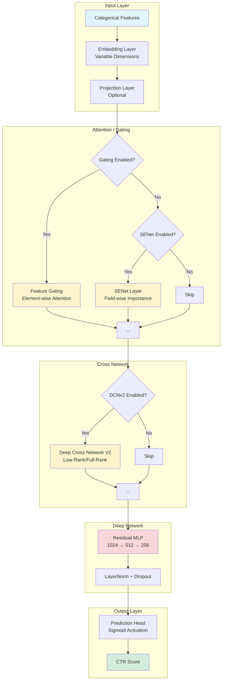

<div align="center">

# 🎯 Avazu CTR Prediction

### Next-Generation Click-Through Rate Prediction with Gated DCNv2 & Ensemble Architecture

[](https://pytorch.org/)
[](https://www.python.org/)
[](https://www.pola.rs/)
[](LICENSE)

[Features](#-features) • [Architecture](#-architecture) • [Quick Start](#-quick-start) • [Configuration](#%EF%B8%8F-configuration) • [Documentation](#-documentation)

</div>

---

## 📖 Overview

A state-of-the-art **Click-Through Rate (CTR)** prediction system for the [Avazu CTR Prediction](https://www.kaggle.com/c/avazu-ctr-prediction) Kaggle competition. This implementation features a highly modular, production-ready codebase with advanced deep learning techniques for sparse feature learning.

### Core Innovations

- **Gated Deep Cross Network V2 (DCNv2)** with low-rank decomposition for efficient high-order feature interactions
- **Ensemble Learning** with configurable model aggregation strategies
- **Dynamic Feature Gating** for adaptive noise suppression in sparse data
- **Dual Optimizer Strategy** (AdamW + Adagrad) for optimal embedding and network parameter updates
- **Memory-Efficient Pipeline** using Polars for blazing-fast data processing

---

## ✨ Features

### Model Architecture
- 🧠 **Advanced Neural Components**
  - Deep Cross Network V2 with optional low-rank decomposition
  - Squeeze-and-Excitation Networks (SENet) from FiBiNET
  - Feature Gating Layers for element-wise attention
  - Residual MLP with skip connections
  - Variable embedding dimensions based on cardinality

- 🎯 **Training Optimizations**
  - Mixed Precision Training (AMP) with float16/bfloat16
  - Gradient clipping and weight decay regularization
  - Focal Loss for handling class imbalance
  - Learning rate warmup with cosine decay
  - Early stopping with validation monitoring

- ⚡ **Performance Features**
  - Ensemble models with mean/median aggregation
  - Model compilation with `torch.compile` (PyTorch 2.0+)
  - TensorBoard integration for real-time monitoring
  - Graceful interruption handling (save best model on Ctrl+C)

### Data Processing
- 📊 **Polars-Powered Pipeline**
  - Streaming data processing for memory efficiency
  - Sequential vocabulary building to prevent memory spikes
  - Direct parquet sink (no intermediate numpy arrays)
  - Expression-based transformations (no Python loops in hot paths)

---

## 🏗 Architecture



### Component Details

#### Deep Cross Network V2 (DCNv2)
Learns explicit high-order feature interactions via bit-wise cross operations:

```
x_{l+1} = x_0 ⊙ (W_l x_l + b_l) + x_l
```

With optional low-rank decomposition: `W = U × V^T` where `U, V ∈ ℝ^(d×r)`, `r ≪ d`

#### Feature Gating Layer
Element-wise multiplicative gating inspired by Gated Linear Units:

```
y = x ⊙ σ(Wx + b)
```

Computationally efficient (O(n) vs O(n²) for self-attention) while achieving strong performance.

#### SENet (Squeeze-and-Excitation)
Field-aware importance weighting from FiBiNET:

```
s = Excitation(Squeeze(x))
y = x ⊙ s
```

Supports multiple squeeze functions (mean, max, min) for enhanced representational power.

---

## 🚀 Quick Start

### Prerequisites

```bash
# Python 3.10+ required
python --version

# Install dependencies
pip install -r requirements.txt
```

**Required Packages:**
- PyTorch 2.0+
- Polars
- NumPy
- scikit-learn
- tqdm

### Data Preparation

1. **Download Data**

   Download `train.gz` and `test.gz` from [Kaggle Avazu CTR Competition](https://www.kaggle.com/c/avazu-ctr-prediction/data)

2. **Organize Data**
   ```bash
   mkdir -p data/raw
   mv train.gz test.gz data/raw/
   ```

3. **Process Data**
   ```bash
   # Run feature engineering and vocabulary building
   python data_processor.py
   ```

   This will:
   - Extract time-based features (hour, day, month, day of week)
   - Create interaction features (device_id × app_id, etc.)
   - Build vocabularies with min frequency filtering
   - Generate parquet files in `data/processed/`

### Training

```bash
# Train with default configuration
python train.py

# Monitor training with TensorBoard (optional)
tensorboard --logdir=runs --port=6006
```

**Training Output:**
- Best model: `checkpoints/best_model.pth`
- Latest model: `checkpoints/model.pth`
- TensorBoard logs: `runs/experiment_TIMESTAMP/`

### Inference

```bash
# Generate predictions
python inference.py

# Output: submission.csv
```

---

## ⚙️ Configuration

All hyperparameters are managed in `src/config/config.py`. Key configuration categories:

### Model Architecture

```python
# Embedding Configuration
"embedding_dim": 64,                    # Base embedding dimension
"use_variable_embeddings": True,        # Cardinality-based embedding sizing
"embedding_dim_rules": [
    (10, 8),    # vocab_size ≤ 10   → 8-dim
    (100, 16),  # vocab_size ≤ 100  → 16-dim
    (500, 24),  # vocab_size ≤ 500  → 24-dim
    # ... higher cardinalities get larger dimensions
],

# Cross Network (DCNv2)
"use_dcn": True,
"dcn_num_layers": 6,
"dcn_low_rank": 32,                     # Low-rank dimension (None = full rank)
"dcn_use_layernorm": False,

# Attention Mechanisms (mutually exclusive)
"use_senet": False,                     # Squeeze-and-Excitation
"use_feature_gating": True,             # Feature Gating (recommended)
"feature_gating_activation": "sigmoid",
"feature_gating_low_rank": 32,

# MLP Configuration
"mlp_hidden_dims": [1024, 512],
"mlp_activation": "gelu",
"mlp_use_skip_connections": True,
"mlp_dropout": 0.1,
```

### Training Strategy

```python
# Optimization
"lr": 1e-3,                             # AdamW learning rate
"embedding_lr": 1.0,                    # Adagrad learning rate (embeddings)
"weight_decay": 1e-3,
"embedding_weight_decay": 0.0,
"grad_clip": 1.0,

# Training Schedule
"epochs": 500,
"batch_size": 4096,
"num_workers": 4,
"early_stopping_patience": 50,

# Loss Function
"focal_loss_gamma": 0.0,                # 0 = BCE, >0 = Focal Loss
"label_smoothing": 0.0,

# Mixed Precision
"auto_amp": True,
"amp_dtype": "float16",                 # or "bfloat16"
```

### Ensemble Configuration

```python
"use_ensemble": True,
"ensemble_k": 3,                        # Number of models
"ensemble_aggregation": "mean",         # "mean" or "median"
```

### Path Configuration

```python
"train_path": "data/raw/train.gz",
"test_path": "data/raw/test.gz",
"processed_path": "data/processed",
"models_path": "./checkpoints",
```

---

## 📁 Project Structure

```
avazu-ctr/
├── 📂 src/                              # Source code (modular architecture)
│   ├── 📂 config/                       # Configuration management
│   │   ├── __init__.py
│   │   └── config.py                    # Central configuration file
│   │
│   ├── 📂 models/                       # Neural network components
│   │   ├── __init__.py
│   │   ├── utils.py                     # Activation functions, embedding utils
│   │   ├── layers/                      # Reusable layer components
│   │   │   ├── __init__.py
│   │   │   ├── attention.py             # SENet layer
│   │   │   ├── gating.py                # Feature gating layer
│   │   │   ├── cross_network.py         # DCNv2 implementation
│   │   │   └── mlp.py                   # Residual MLP
│   │   └── architectures/               # Complete model architectures
│   │       ├── __init__.py
│   │       ├── base_model.py            # GatedDCNModel
│   │       └── ensemble.py              # EnsembleModel wrapper
│   │
│   ├── 📂 processing/                   # Data processing pipeline
│   │   ├── __init__.py
│   │   ├── data_processor.py            # Polars-based ETL pipeline
│   │   ├── dataset.py                   # PyTorch Dataset classes
│   │   └── processors/                  # Modular processors (future)
│   │       └── __init__.py
│   │
│   ├── 📂 training/                     # Training components
│   │   ├── __init__.py
│   │   ├── losses.py                    # FocalLoss implementation
│   │   ├── schedulers.py                # LR scheduler with warmup
│   │   ├── evaluator.py                 # Model evaluation logic
│   │   └── trainer.py                   # Main training loop
│   │
│   └── 📂 inference/                    # Inference pipeline
│       ├── __init__.py
│       └── inference.py                 # Prediction generation
│
├── 📂 tests/                            # Unit and integration tests
│   ├── __init__.py
│   └── test_models.py                   # Model architecture tests
│
├── 📂 misc/                             # Miscellaneous scripts
│   └── eda.py                           # Exploratory data analysis
│
├── 📂 data/                             # Data directory (gitignored)
│   ├── 📂 raw/                          # Raw competition data
│   │   ├── train.gz
│   │   └── test.gz
│   └── 📂 processed/                    # Processed parquet files
│       ├── train.parquet
│       ├── test.parquet
│       ├── vocab_sizes.pkl
│       └── feature_names.pkl
│
├── 📂 checkpoints/                      # Model checkpoints (gitignored)
│   ├── best_model.pth
│   └── model.pth
│
├── 📂 runs/                             # TensorBoard logs (gitignored)
│
├── 📄 train.py                          # Training entry point
├── 📄 data_processor.py                 # Data processing entry point
├── 📄 inference.py                      # Inference entry point
├── 📄 requirements.txt                  # Python dependencies
├── 📄 README.md                         # This file
└── 📄 .gitignore                        # Git ignore rules
```

### Module Organization Principles

- **Separation of Concerns**: Each module has a single, well-defined responsibility
- **Dependency Injection**: Configuration passed explicitly, not globally imported
- **Backward Compatibility**: `src/models/model.py` provides legacy imports
- **Testability**: Small, focused modules with clear interfaces
- **Extensibility**: Easy to add new layers, losses, or data processors

---

## 🧪 Experiments & Ablation Studies

### Recommended Configurations

| Experiment | Configuration | Expected Impact |
|:-----------|:-------------|:---------------|
| **Baseline** | Default config | Strong baseline with Feature Gating + DCNv2 |
| **SENet Variant** | `use_senet=True`<br>`use_feature_gating=False` | Field-aware attention (FiBiNET style) |
| **Focal Loss** | `focal_loss_gamma=2.0` | Better handling of class imbalance |
| **Full-Rank DCN** | `dcn_low_rank=None` | Higher capacity, slower training |
| **Larger Ensemble** | `ensemble_k=5` | Better generalization, longer training |
| **BFloat16** | `amp_dtype="bfloat16"` | Better numerical stability than float16 |

### Performance Optimization Tips

1. **Batch Size Tuning**
   - Increase `batch_size` (4096 → 8192) for faster training on high-end GPUs
   - Decrease if encountering OOM errors

2. **Embedding Strategy**
   - Enable `use_variable_embeddings=True` for memory efficiency
   - Tune `embedding_dim_rules` based on your feature cardinalities (see `misc/eda.py`)

3. **Regularization**
   - Increase `mlp_dropout` (0.1 → 0.2) if overfitting
   - Increase `weight_decay` (1e-3 → 1e-2) for stronger L2 regularization

4. **Architecture Depth**
   - Deeper DCN: `dcn_num_layers=8` (more interactions)
   - Deeper MLP: `mlp_hidden_dims=[1024, 512, 256, 128]` (more capacity)

---

## 📊 Model Evaluation

### Metrics

The model is evaluated using:
- **ROC-AUC**: Primary metric for ranking quality
- **Log Loss**: Calibration quality of predicted probabilities
- **Binary Cross-Entropy**: Training loss

### Validation Strategy

```python
"validation_split": 0.0  # Set to 0.1 for 10% validation split
```

When validation is enabled:
- Early stopping monitors validation AUC
- Best model saved based on validation performance
- TensorBoard logs both train and validation metrics

---

## 🛠 Development

### Running Tests

```bash
# Run all tests
python -m pytest tests/

# Run specific test file
python tests/test_models.py

# Run with verbose output
python tests/test_models.py -v
```

### Code Style

This project follows:
- **PEP 8** for Python code style
- **Type hints** for function signatures
- **Docstrings** for public APIs
- **Absolute imports** (`from src.module import ...`)

### Adding New Components

**Example: Adding a new layer**

1. Create `src/models/layers/my_layer.py`:
   ```python
   import torch.nn as nn

   class MyLayer(nn.Module):
       """Your layer implementation."""
       def __init__(self, input_dim: int):
           super().__init__()
           # ...

       def forward(self, x):
           # ...
           return x
   ```

2. Export in `src/models/layers/__init__.py`:
   ```python
   from .my_layer import MyLayer
   __all__ = [..., 'MyLayer']
   ```

3. Use in `src/models/architectures/base_model.py`:
   ```python
   from src.models.layers import MyLayer
   ```

---

## 📚 Documentation

### Key Papers & References

- **DCNv2**: [DCN V2: Improved Deep & Cross Network](https://arxiv.org/abs/2008.13535) (Wang et al., 2021)
- **FiBiNET**: [FiBiNET: Combining Feature Importance and Bilinear feature Interaction](https://arxiv.org/abs/1905.09433) (Huang et al., 2019)
- **Focal Loss**: [Focal Loss for Dense Object Detection](https://arxiv.org/abs/1708.02002) (Lin et al., 2017)

### Additional Resources

- [Competition Page](https://www.kaggle.com/c/avazu-ctr-prediction)
- [PyTorch Documentation](https://pytorch.org/docs/stable/index.html)
- [Polars User Guide](https://pola-rs.github.io/polars-book/)

---

## 🤝 Contributing

Contributions are welcome! Please feel free to submit a Pull Request. For major changes:

1. Fork the repository
2. Create a feature branch (`git checkout -b feature/AmazingFeature`)
3. Commit your changes (`git commit -m 'Add some AmazingFeature'`)
4. Push to the branch (`git push origin feature/AmazingFeature`)
5. Open a Pull Request

---

## 📄 License

This project is licensed under the MIT License - see the [LICENSE](LICENSE) file for details.

---

## 🙏 Acknowledgments

- Avazu for providing the CTR prediction dataset
- PyTorch team for the excellent deep learning framework
- Polars contributors for the blazing-fast data processing library
- Research community for foundational papers on CTR prediction

---

<div align="center">

**Built with ❤️ using PyTorch & Polars**

*For questions or collaboration: [Open an issue](../../issues)*

</div>
