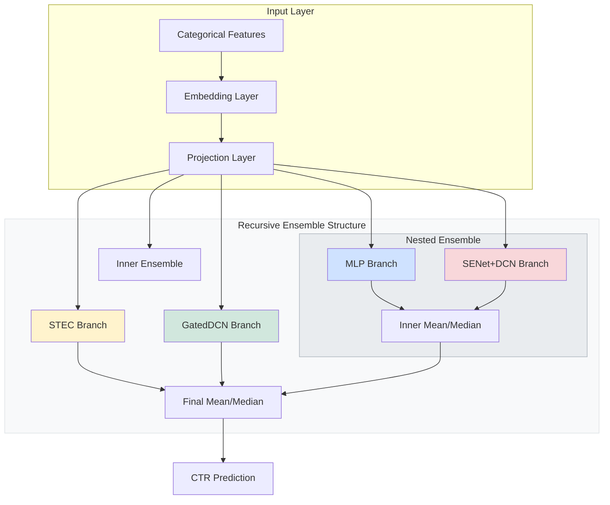

<div align="center">

# 🎯 Avazu CTR Prediction

### Next-Generation Click-Through Rate Prediction with Gated DCNv2 & Ensemble Architecture

[](https://pytorch.org/)
[](https://www.python.org/)
[](https://www.pola.rs/)
[](LICENSE)

[Features](#-features) • [Architecture](#-architecture) • [Quick Start](#-quick-start) • [Configuration](#%EF%B8%8F-configuration) • [Documentation](#-documentation)

</div>

---

## 📖 Overview

A state-of-the-art **Click-Through Rate (CTR)** prediction system for the [Avazu CTR Prediction](https://www.kaggle.com/c/avazu-ctr-prediction) Kaggle competition. This implementation features a highly modular, production-ready codebase with advanced deep learning techniques for sparse feature learning.

### Core Innovations

- **STEC (See-Through Transformer-based Encoder)**: Novel architecture that extracts bilinear interactions from attention mechanisms at no additional computational cost
- **Gated Deep Cross Network V2 (DCNv2)**: Advanced feature interaction layer with gating mechanisms and low-rank decomposition options
- **Hash Embedding Layer**: Memory-efficient handling of very high-cardinality features using multiple-hash collisions and importance weighting
- **Multi-Level Interaction Fusion**: Direct connections from all encoder layers to the final prediction head
- **Hybrid Optimizer Strategy**: Support for AdamW + Adagrad or FTRL (Follow-the-Regularized-Leader) for optimal sparse feature learning
- **Memory-Efficient Pipeline** using Polars for blazing-fast data processing and streaming

---

## ✨ Features

### Model Architecture
- 🧠 **Advanced Neural Components**
  - **STEC Architecture (Default)**
    - Multi-Head Group Bilinear Interactions
    - See-Through connections for gradient flow
    - Transformer-based encoder with FFN
  - **DCNv2 (Gated Deep Cross Network)**
    - Explicit high-order feature interactions
    - Gating mechanisms for selective interaction
    - Low-rank decomposition for parameter efficiency
  - **Squeeze-and-Excitation (SENet)**
    - Field-level importance weighting
    - Multi-mode squeezing (mean, max, min)
  - **Memory-Efficient Embeddings**
    - Standard `nn.Embedding` for low-mid cardinality
    - **Hash Embeddings** for extremely high cardinality (e.g., user_id, device_ip)
    - Variable embedding dimensions per feature

- 🎯 **Training Optimizations**
  - **Mixed Precision Training (AMP)** with float16/bfloat16
  - **Optimizer Modes**
    - `adamw_adagrad`: Hybrid AdamW (network) and Adagrad (embeddings)
    - `ftrl`: Follow-the-Regularized-Leader for high sparsity
  - Focal Loss and Binary Cross-Entropy support
  - Learning rate warmup with cosine decay
  - Early stopping with validation monitoring

- ⚡ **Performance Features**
  - **Heterogeneous Recursive Ensembles**
    - Multi-level nested ensemble support
    - Hybrid architectures (STEC, DCNv2, and MLP-only in one ensemble)
    - Mean/Median aggregation at every level
    - Recursive structural loss (K-BCE) for deep supervision
  - Model compilation with `torch.compile` (PyTorch 2.0+)
  - TensorBoard integration for real-time monitoring
  - Graceful interruption handling (save best model on Ctrl+C)

### Data Processing
- 📊 **Polars-Powered Pipeline**
  - Streaming data processing for memory efficiency
  - Sequential vocabulary building to prevent memory spikes
  - **Automated Configuration EDA**: Analysis scripts to recommend optimal embedding dimensions and hash bucket sizes
  - Direct parquet sink (no intermediate numpy arrays)
  - Expression-based transformations (no Python loops in hot paths)

---

## 🏗 Architecture



### Component Details

#### STEC (See-Through Transformer-based Encoder)
The default architecture that improves upon standard Transformers for CTR:
1. **Cost-Free Interactions**: Reuses attention scores to compute bilinear interactions without extra matrix multiplications.
2. **See-Through Path**: Exports interactions from every layer directly to the final classification head, preventing signal degradation.
3. **Group Bilinear**: Performs interactions within heads to capture diverse feature crosses.

#### Component Availability
The system is highly modular. While STEC is default, you can enable/disable other components via config:
- **DCNv2**: Explicit high-order interactions (`use_dcn=True`)
- **Feature Gating**: Element-wise filtering (`use_feature_gating=True`)
- **SENet**: Field-wise importance (`use_senet=True`)
- **Ensemble**: Combine multiple models recursively (`"models": [...]`)

---

## 🚀 Quick Start

### Prerequisites

```bash
# Python 3.10+ required
python --version

# Install dependencies
pip install -r requirements.txt
```

**Required Packages:**
- PyTorch 2.0+
- Polars
- NumPy
- scikit-learn
- tqdm

### Data Preparation

1. **Download Data**

   Download `train.gz` and `test.gz` from [Kaggle Avazu CTR Competition](https://www.kaggle.com/c/avazu-ctr-prediction/data)

2. **Organize Data**
   ```bash
   mkdir -p data/raw
   mv train.gz test.gz data/raw/
   ```

4. **Analyze & Optimize (Optional)**
   ```bash
   # Run EDA on preprocessed data to get optimal embedding configs
   python -m misc.eda_preprocessed
   ```

   This will analyze vocabulary sizes and suggest the best `feature_embeddings` configuration for `config.py`.

5. **Process Data**
   ```bash
   # Run feature engineering and vocabulary building
   python data_processor.py
   ```

   This will:
   - Extract time-based features (hour, day, month, day of week)
   - Create interaction features (device_id × app_id, etc.)
   - Build vocabularies with min frequency filtering
   - Generate parquet files in `data/processed/`

### Training

```bash
# Train with default configuration
python train.py

# Monitor training with TensorBoard (optional)
tensorboard --logdir=runs --port=6006
```

**Training Output:**
- Best model: `checkpoints/best_model.pth`
- Latest model: `checkpoints/model.pth`
- TensorBoard logs: `runs/experiment_TIMESTAMP/`

### Inference

```bash
# Generate predictions
python inference.py

# Output: submission.csv
```

---

## ⚙️ Configuration

All hyperparameters are managed in `src/config/config.py`. Key configuration categories:

### Model Architecture

```python
# The model configuration is a unified structure supporting recursive ensembles
"model": {
    "models": [
        # --- Model 1: GatedDCN ---
        {
            "use_dcn": True,
            "dcn_num_layers": 3,
            "use_feature_gating": True,
            "mlp_hidden_dims": [512, 256],
            ...
        },
        # --- Model 2: STEC ---
        {
            "stec_num_layers": 2,
            "stec_num_heads": 4,
            "stec_mlp_hidden_dims": [256, 128],
            ...
        },
        # --- Model 3: Nested Ensemble ---
        {
            "models": [
                { "use_dcn": False, "mlp_hidden_dims": [512, 256, 128], ... },
                { "use_dcn": True, "use_senet": True, ... }
            ],
            "ensemble_aggregation": "mean"
        }
    ],
    "ensemble_aggregation": "mean"
}

# Embedding Configuration
"embedding_dim": 16,            # Default dimension
"feature_embeddings": {         # Granular per-feature config
    "site_id": {"type": "standard", "dim": 32},
    "user_id": {"type": "hash", "dim": 32, "num_buckets": 10000},
},
"embedding_projection_dim": None,
```

### Training Strategy

```python
# Optimization
"lr": 1e-4,
"embedding_lr": 0.5,
"optimizer_mode": "adamw_adagrad",      # "adamw_adagrad" or "ftrl"
"weight_decay": 1e-4,
"grad_clip": 1.0,

# FTRL Specific (if enabled)
"ftrl_alpha": 0.1,
"ftrl_l1": 2.0,
"ftrl_l2": 1.0,

# Training Schedule
"epochs": 500,
"batch_size": 4096,
"num_workers": 4,
"early_stopping_patience": 50,

# Loss Function
"focal_loss_gamma": 0.0,                # 0 = BCE, >0 = Focal Loss
"label_smoothing": 0.0,

# Mixed Precision
"auto_amp": True,
"amp_dtype": "float16",                 # or "bfloat16"
```

### Optimization

```python
"lr": 1e-4,
"embedding_lr": 0.01,
"optimizer_mode": "adamw_adagrad",      # Hybrid optimizer
"ftrl_alpha": 0.1,                      # Only used if mode="ftrl"
"weight_decay": 1e-4,
"grad_clip": 1.0,
```

### Path Configuration

```python
"train_path": "data/raw/train.gz",
"test_path": "data/raw/test.gz",
"processed_path": "data/processed",
"models_path": "./checkpoints",
```

---

## 📁 Project Structure

```
avazu-ctr/
├── 📂 src/                              # Source code (modular architecture)
│   ├── 📂 config/                       # Configuration management
│   │   ├── __init__.py
│   │   └── config.py                    # Central configuration file
│   │
│   ├── 📂 models/                       # Neural network components
│   │   ├── __init__.py
│   │   ├── utils.py                     # Activation functions, embedding utils
│   │   ├── types.py                     # Type definitions
│   │   ├── layers/                      # Reusable layer components
│   │   │   ├── __init__.py
│   │   │   ├── stec_encoder.py          # STEC Transformer layers
│   │   │   ├── multi_head_stec.py       # Multi-head attention & bilinear
│   │   │   ├── bilinear_interaction.py  # Explicit bilinear interactions
│   │   │   ├── gating.py                # Feature gating (legacy)
│   │   │   ├── cross_network.py         # DCNv2 (legacy)
│   │   │   └── mlp.py                   # Residual MLP
│   │   ├── architectures/               # Complete model architectures
│   │   │   ├── __init__.py
│   │   │   ├── base.py                  # Abstract base class
│   │   │   ├── stec.py                  # STECModel (Default)
│   │   │   ├── gated_dcn.py             # GatedDCNModel (Legacy)
│   │   │   └── ensemble.py              # EnsembleModel wrapper
│   │   └── losses/                      # Loss functions
│   │       ├── __init__.py
│   │       └── losses.py                # Focal Loss
│   │
│   ├── 📂 processing/                   # Data processing pipeline
│   │   ├── __init__.py
│   │   ├── data_processor.py            # Polars-based ETL pipeline
│   │   └── dataset.py                   # PyTorch Dataset classes
│   │
│   ├── 📂 training/                     # Training components
│   │   ├── __init__.py
│   │   ├── evaluator.py                 # Model evaluation logic
│   │   ├── schedulers.py                # LR scheduler with warmup
│   │   └── trainer.py                   # Main training loop
│   │
│   └── 📂 inference/                    # Inference pipeline
│       ├── __init__.py
│       └── inference.py                 # Prediction generation
│
├── 📂 tests/                            # Unit and integration tests
├── 📂 misc/                             # Exploratory Data Analysis & Utilities
│   ├── eda_raw.py                       # Initial raw data analysis
│   └── eda_preprocessed.py              # Embedding configuration optimizer
├── 📂 data/                             # Data directory (gitignored)
├── 📂 checkpoints/                      # Model checkpoints (gitignored)
├── 📂 runs/                             # TensorBoard logs (gitignored)
│
├── 📄 train.py                          # Training entry point
├── 📄 data_processor.py                 # Data processing entry point
├── 📄 inference.py                      # Inference entry point
├── 📄 requirements.txt                  # Python dependencies
├── 📄 README.md                         # This file
└── 📄 .gitignore                        # Git ignore rules
```

### Module Organization Principles

- **Separation of Concerns**: Each module has a single, well-defined responsibility
- **Dependency Injection**: Configuration passed explicitly, not globally imported
- **Backward Compatibility**: `src/models/model.py` provides legacy imports
- **Testability**: Small, focused modules with clear interfaces
- **Extensibility**: Easy to add new layers, losses, or data processors

---

## 🧪 Experiments & Ablation Studies

### Recommended Configurations

| Experiment | Configuration | Expected Impact |
|:-----------|:-------------|:---------------|
| **Baseline (STEC)** | `use_stec=True` | State-of-the-art transformer encoder with free bilinear interactions |
| **GatedDCN (Legacy)** | `use_stec=False`<br>`use_dcn=True` | Previous baseline with explicit low-rank cross network |
| **Focal Loss** | `focal_loss_gamma=2.0` | Better handling of class imbalance |
| **Ensemble** | `use_ensemble=True` | Averaging predictions from multiple models |
| **Larger Ensemble** | `ensemble_k=5` | Better generalization, longer training |
| **BFloat16** | `amp_dtype="bfloat16"` | Better numerical stability than float16 |

### Performance Optimization Tips

1. **Batch Size Tuning**
   - Increase `batch_size` (4096 → 8192) for faster training on high-end GPUs
   - Decrease if encountering OOM errors

2. **Embedding Strategy**
   - Use granular `feature_embeddings` in `config.py` for memory efficiency
   - Tune embedding dimensions based on feature cardinalities (see `misc/eda_preprocessed.py`)

3. **Regularization**
   - Increase `mlp_dropout` (0.1 → 0.2) if overfitting
   - Increase `weight_decay` (1e-3 → 1e-2) for stronger L2 regularization

4. **Architecture Depth**
   - Deeper DCN: `dcn_num_layers=8` (more interactions)
   - Deeper MLP: `mlp_hidden_dims=[1024, 512, 256, 128]` (more capacity)

---

## 📊 Model Evaluation

### Metrics

The model is evaluated using:
- **ROC-AUC**: Primary metric for ranking quality
- **Log Loss**: Calibration quality of predicted probabilities
- **Binary Cross-Entropy**: Training loss

### Validation Strategy

```python
"validation_split": 0.0  # Set to 0.1 for 10% validation split
```

When validation is enabled:
- Early stopping monitors validation AUC
- Best model saved based on validation performance
- TensorBoard logs both train and validation metrics

---

## 🛠 Development

### Running Tests

```bash
# Run all tests
python -m pytest tests/

# Run specific test file
python tests/test_models.py

# Run with verbose output
python tests/test_models.py -v
```

### Code Style

This project follows:
- **PEP 8** for Python code style
- **Type hints** for function signatures
- **Docstrings** for public APIs
- **Absolute imports** (`from src.module import ...`)

### Adding New Components

**Example: Adding a new layer**

1. Create `src/models/layers/my_layer.py`:
   ```python
   import torch.nn as nn

   class MyLayer(nn.Module):
       """Your layer implementation."""
       def __init__(self, input_dim: int):
           super().__init__()
           # ...

       def forward(self, x):
           # ...
           return x
   ```

2. Export in `src/models/layers/__init__.py`:
   ```python
   from .my_layer import MyLayer
   __all__ = [..., 'MyLayer']
   ```

3. Use in `src/models/architectures/base_model.py`:
   ```python
   from src.models.layers import MyLayer
   ```

---

## 📚 Documentation

### Key Papers & References

- **DCNv2**: [DCN V2: Improved Deep & Cross Network](https://arxiv.org/abs/2008.13535) (Wang et al., 2021)
- **FiBiNET**: [FiBiNET: Combining Feature Importance and Bilinear feature Interaction](https://arxiv.org/abs/1905.09433) (Huang et al., 2019)
- **Focal Loss**: [Focal Loss for Dense Object Detection](https://arxiv.org/abs/1708.02002) (Lin et al., 2017)

### Additional Resources

- [Competition Page](https://www.kaggle.com/c/avazu-ctr-prediction)
- [PyTorch Documentation](https://pytorch.org/docs/stable/index.html)
- [Polars User Guide](https://pola-rs.github.io/polars-book/)

---

## 🤝 Contributing

Contributions are welcome! Please feel free to submit a Pull Request. For major changes:

1. Fork the repository
2. Create a feature branch (`git checkout -b feature/AmazingFeature`)
3. Commit your changes (`git commit -m 'Add some AmazingFeature'`)
4. Push to the branch (`git push origin feature/AmazingFeature`)
5. Open a Pull Request

---

## 📄 License

This project is licensed under the MIT License - see the [LICENSE](LICENSE) file for details.

---

## 🙏 Acknowledgments

- Avazu for providing the CTR prediction dataset
- PyTorch team for the excellent deep learning framework
- Polars contributors for the blazing-fast data processing library
- Research community for foundational papers on CTR prediction

---

<div align="center">

**Built with ❤️ using PyTorch & Polars**

*For questions or collaboration: [Open an issue](../../issues)*

</div>
