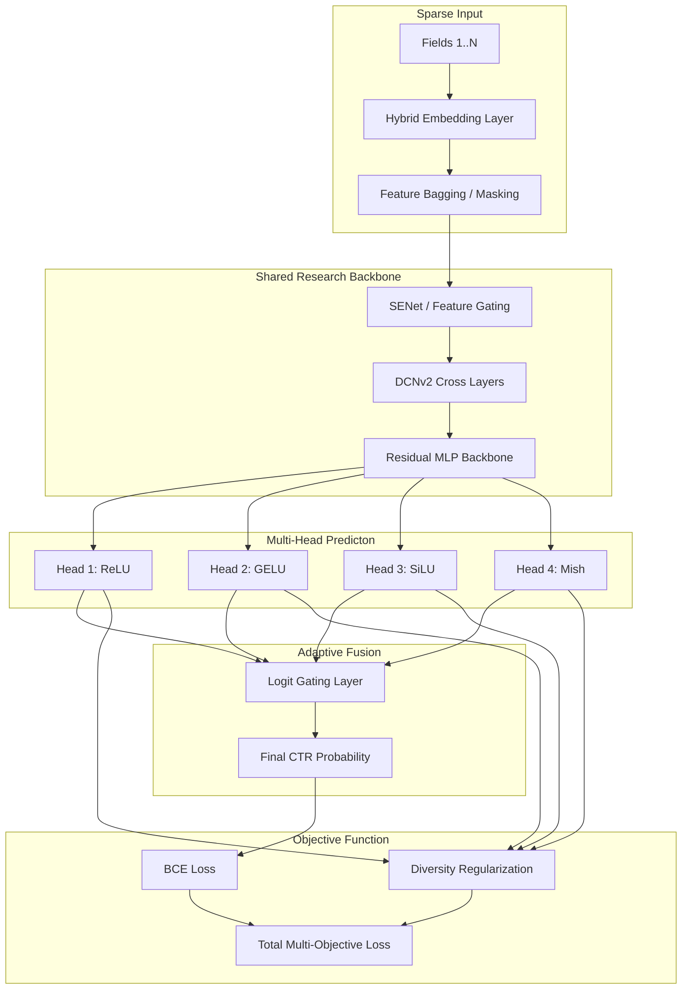

# 🔬 CTR Architecture Research Laboratory

### Advancing State-of-the-Art Click-Through Rate Prediction via Literature-Hybrid Architectures

[](https://pytorch.org/)
[](https://www.python.org/)
[](https://optuna.org/)
[](papers/)

---

## 🏛 Research Vision

This project serves as a laboratory for exploring and synthesizing state-of-the-art architectures in **Click-Through Rate (CTR)** prediction. Rather than implementing a single traditional model, we focus on **Hybrid Architecture Synthesis**—combining orthogonal strengths from various seminal research papers into unified, high-performance encoders.

Our primary goal is to investigate how **explicit cross-networks**, **attention-based encoders**, and **field-level importance gating** can be fused to capture complex feature interactions in high-cardinality sparse datasets like Avazu.

---

## 📚 Literature-Informed Architectural Pillars

The laboratory currently implements and synthesizes ideas from several key research directions:

### 1. Deep & Cross Network Evolution (DCNv2/v3)
*   **Source**: *DCN V2: Improved Deep & Cross Network* (Wang et al., 2021)
*   **Mechanism**: Uses learnable weight matrices to model explicit, bounded-degree polynomial feature interactions.
*   **Hybrid Implementation**: Supports low-rank decomposition for parameter efficiency and gated units for non-linear interaction selection.

### 2. Squeeze-Excitation & Bilinear Interaction (FiBiNET/++)
*   **Source**: *FiBiNET: Combining Feature Importance and Bilinear feature Interaction* (Huang et al., 2019)
*   **Mechanism**: **SENet** layer dynamically learns field-level importance weights, followed by a **Bilinear Interaction** layer to capture fine-grained relations.
*   **Hybrid Implementation**: Incorporates multi-mode squeezing (Mean, Max, Min, Std) and grouped squeeze operations for noise reduction.

### 3. See-Through Transformer Encoding (STEC)
*   **Source**: *STEC-Transformer: See-Through Transformer-based Encoder for CTR*
*   **Mechanism**: A transformer-based encoder that extracts multi-head group bilinear interactions directly from attention mechanisms.
*   **Hybrid Implementation**: Features "See-Through" paths that preserve signal flow from all layers to the prediction head, mitigating the vanishing interaction problem.

### 4. Multi-Head Diversity Enrichment
*   **Source**: *Research into Deep Ensembles & Diversity Regularization*
*   **Mechanism**: Instead of a simple ensemble, we utilize a **Shared Backbone** with **Diverse Prediction Heads**, regularized by a **Diversity Loss** term.
*   **Implementation**: Features **Feature Bagging** (random field masking per head) and gated logit aggregation to ensure heads capture non-redundant interaction patterns.

---

## 🏗 The Hybrid: MultiHeadDiversityModel

The flagship architecture of this lab is the `MultiHeadDiversityModel`. It represents our current best attempt at architectural synthesis:



---

## 🚀 Experimental Framework

### Automated Hyperparameter Optimization (Optuna)
We use **Optuna** to navigate the vast search space (~34 parameters) of our hybrid architectures. Our advanced tuning script supports:
- **TPE (Tree-structured Parquet Estimator)** for Bayesian search.
- **MedianPruner** for aggressive early stopping of unpromising trials.
- **SQLite Persistence** for resuming large-scale studies.

```bash
# Launch a 100-trial optimization study
python misc/tune_hyperparams.py --n-trials 100 --timeout 28800
```

### Key Search Dimensions:
- **Interaction Depth**: Number of DCN layers vs. Transformer layers.
- **Diversity Calibration**: Tuning the weight of diversity regularization.
- **Per-Head Specialized Hyperparameters**: Individual activation functions and skip-connection strategies for each prediction head.
- **Embedding Dynamics**: Adaptive learning rates for sparse vs. dense parameters.

---

## 🛠 Project Structure

- `src/models/architectures/`: Full hybrid implementations (STEC, MultiHeadDiversity, GatedDCN).
- `src/models/layers/`: Primitive research blocks (CrossNetwork, SENet, FeatureGating, LogitGating).
- `src/training/`: Training engine with hybrid optimizer support (AdamW/Adagrad/FTRL).
- `misc/`: Research tools including `tune_hyperparams.py` and structural EDA scripts.
- `papers/`: Local repository of foundational research papers guiding this project.

---

## 📈 Getting Started

1. **Environment Setup**:
   ```bash
   pip install -r requirements.txt
   ```

2. **Data Pipeline**:
   ```bash
   python data_processor.py  # Blazing fast Polars-based processing
   ```

3. **Research Loop**:
   ```bash
   # 1. Start a tuning study to find architectural sweet spots
   python misc/tune_hyperparams.py --n-trials 50
   
   # 2. Train the full model with best config
   python train.py
   
   # 3. Analyze results via TensorBoard
   tensorboard --logdir=runs
   ```

---

## 📄 License & Acknowledgments
- Foundation: Avazu CTR Prediction Dataset.
- Architecture: Synthesized from DCNv2, FiBiNET, and STEC papers.
- Tools: Built with PyTorch, Polars, and Optuna.

Licensed under the MIT License.
