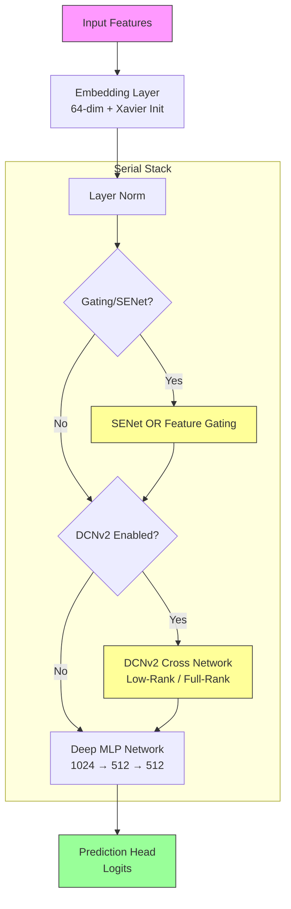

<p align="center">
  
  
  
  
  
</p>

<h1 align="center">🎯 Avazu Click-Through Rate Prediction</h1>

<p align="center">
  <strong>Next-Gen CTR Prediction with Gated DCNv2 & FiBiNET Architecture</strong>
</p>

<p align="center">
  <a href="#-features">Features</a> •
  <a href="#-architecture">Architecture</a> •
  <a href="#-quick-start">Quick Start</a> •
  <a href="#-configuration">Configuration</a> •
  <a href="#-results">Results</a>
</p>

---

## 📋 Overview

This project implements a state-of-the-art **Click-Through Rate (CTR)** prediction pipeline for the [Avazu CTR Prediction](https://www.kaggle.com/c/avazu-ctr-prediction) competition. It introduces a highly configurable **GatedDCNModel** that unifies multiple advanced techniques:

*   **Deep Cross Network V2 (DCNv2)** for explicit high-order interactions.
*   **SE-Net (FiBiNET)** for dynamic feature importance.
*   **Feature Gating** for noise suppression and sparsity handling.

> **Why this model?** It combines the best of "cross" networks (explicit interactions) with "deep" networks (implicit interactions) and adds modern "attention/gating" mechanisms to focus on what matters.

---

## ✨ Key Features

| Feature | Description |
| :--- | :--- |
| **Feature Gating** 🆕 | **New!** Element-wise gating mechanism to suppress noise and highlight important features (Alternative to SE-Net). |
| **DCNv2** | Deep Cross Network V2 with **Low-Rank Decomposition** to capture high-order interactions efficiently. |
| **SE-Net** | Squeeze-and-Excitation network (from FiBiNET) for dynamic feature re-weighting. |
| **Dual Optimizer** | **Adagrad** (lr=1.0) for embeddings + **AdamW** (lr=1e-3) for deep layers. |
| **Focal Loss** | Configurable loss function (Gamma > 0) to handle severe class imbalance. |
| **Polars Processing** | Blazing fast data preprocessing using the Polars library. |
| **TensorBoard** | Built-in logging for loss curves, AUC, and learning rate schedules. |
| **Graceful Exit** | Safely interrupt training (Ctrl+C) and save the best model found so far. |

---

## 🏗 Architecture

The model architecture is modular, allowing you to toggle components via `config.py`.



### Component Details

#### 1. Feature Gating (New standard)
Inspired by Gated Linear Units, this layer applies a learned gate to suppress noisy features:
$$y = x \odot \sigma(W x)$$
This is computationally cheaper than Self-Attention (linear vs quadratic) but highly effective for sparse data.

#### 2. DCNv2 (Deep Cross Network)
Captures explicit feature interactions. We support **Low-Rank Decomposition** to reduce parameter count:
$$W = U \cdot V^T, \quad \text{where } U \in \mathbb{R}^{d \times r}, V \in \mathbb{R}^{d \times r}, \ r \ll d$$

---

## 🚀 Quick Start

### 1. Setup Environment
```bash
# Clone and enter
git clone https://github.com/yourusername/avazu-ctr.git
cd avazu-ctr

# Install dependencies (Torch, Polars, Scikit-learn)
pip install -r requirements.txt
```

### 2. Prepare Data
Download `train.gz` and `test.gz` from [Kaggle](https://www.kaggle.com/c/avazu-ctr-prediction/data) into the `./data/` folder.

```bash
# Process raw data (encodes features, builds vocab)
python data_processor.py
```

### 3. Train
```bash
# Start training (default: 2 epochs, batch size 2048)
python train.py

# Launch TensorBoard to view progress
tensorboard --logdir=runs
```

### 4. Inference
```bash
# Generate submission.csv
python inference.py
```

---

## ⚙️ Configuration

Hyperparameters are centrally managed in `config.py`. Below are the defaults:

### Model Architecture
```python
"embedding_dim": 64,
"use_dcn": True,
"dcn_low_rank": 32,           # Low-rank dim (set None for full rank)

# Attention / Gating (choose one)
"use_senet": False,           # FiBiNET style
"use_feature_gating": True,   # Gated Attention style (Recommended)
"feature_gating_activation": "sigmoid",

"mlp_hidden_dims": [1024, 512, 512],
"mlp_activation": "gelu",     # GELU, ReLU, SiLU
"use_layer_norm": True,
```

### Training Strategy
```python
"batch_size": 2048,           # Large batch size for stability
"epochs": 2,                  # Fast convergence
"lr": 1e-3,                   # AdamW learning rate
"embedding_lr": 1.0,          # Adagrad learning rate (high for embeddings)
"focal_loss_gamma": 0.0,      # Set > 0 (e.g., 2.0) to enable Focal Loss
```

> **💡 Pro Tip:** To switch back to the classic FiBiNET architecture, set `use_feature_gating: False` and `use_senet: True` in `config.py`.

---

## 🧪 Experiments & Ablation

We recommend trying the following configurations to boost performance:

| Configuration | Config Change | Effect |
| :--- | :--- | :--- |
| **Enable SENet** | `use_senet=True`<br>`use_feature_gating=False` | Uses field-aware importance weights (classic FiBiNET). |
| **Enable Focal Loss** | `focal_loss_gamma=2.0` | Focuses training on "hard" negatives. |
| **Full-Rank DCN** | `dcn_low_rank=None` | Increases expressivity (slower training). |
| **Deeper MLP** | `mlp_hidden_dims=[1024, 512, 512, 256]` | Captures more complex implicit interactions. |

---

## 📁 specific Project Structure

```
avazu-ctr/
├── 📄 config.py           # ⚙️  The Brain: All hyperparameters here
├── 📄 data_processor.py   # ⚡  Polars data pipeline
├── 📄 model.py            # 🧠  GatedDCNModel, DCNv2, SENet, FeatureGating
├── 📄 train.py            # 🚂  Training loop, FocalLoss, Logging
├── 📄 inference.py        # 🔮  Prediction generation
├── 📄 dataset.py          # 💾  PyTorch Dataset
├── 📄 tests.py            # 🧪  Unit tests
└── 📁 data/               #     Data storage
```

---

<p align="center">
  Built with PyTorch❤️ for High-Performance CTR Prediction
</p>
